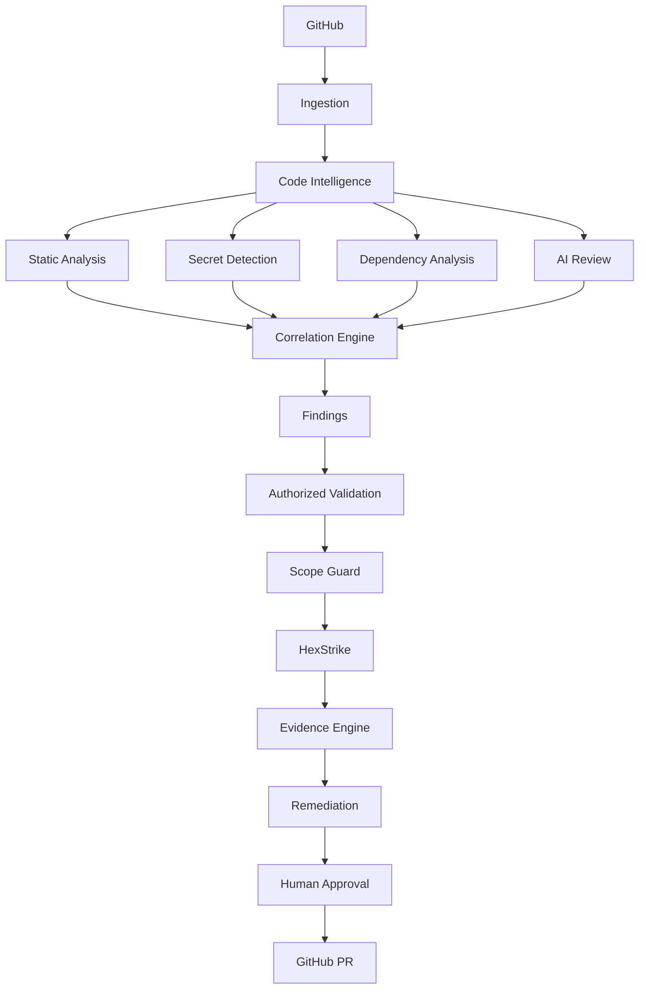

# Sayan Sentinel

**AI-Native Application Security & Code Intelligence**

> Understand your code. Find vulnerabilities. Verify safely. Fix intelligently. Ship safer software.


Built by [Sayan Stack](https://github.com/).

---

## What this is

Sayan Sentinel connects to an authorized GitHub repository, builds an
internal code graph, runs deterministic security analysis (SAST, secret
detection, dependency scanning), correlates the results with AI-assisted
reasoning, and — only against explicitly authorized targets, behind a
deterministic Scope Guard — offers optional dynamic validation via
[HexStrike AI](https://github.com/) before generating a human-reviewed
remediation PR.

This is **not** a vulnerability scanner you point at arbitrary internet
targets, and it does not claim a capability is complete unless it genuinely
is. See [Status](#status) below for exactly what's real today.

## Status

This repository is being built in public, phase by phase, tracked in
[docs/implementation-plan.md](docs/implementation-plan.md). Currently:

- ✅ Monorepo scaffold (pnpm + Turborepo), root tooling, local infra
  (`docker compose up` for Postgres/Redis/MinIO)
- ✅ `packages/shared`, `packages/config`, `packages/database` — vocabulary
  types, validated env/feature-flag loading, and the full tenant-isolated
  Prisma schema
- ✅ `apps/api` skeleton — structured logging with request IDs and secret
  redaction, plus `/health/live` and `/health/ready` (the latter genuinely
  checks Postgres and Redis and reports `down` truthfully when they're
  unreachable, verified end-to-end with no infra running)
- ✅ `packages/code-intelligence` — repository ingestion (real `git`
  subprocess calls, path-traversal/symlink protection, size limits, binary
  exclusion, no repository code is ever executed) and an AST-based code
  graph (`ts-morph`) detecting imports, functions/classes/methods, Express
  and NestJS routes, env-var reads, outbound HTTP calls, Prisma-style
  queries, and NestJS auth guards
- ✅ `packages/findings` — canonical Finding model and stable,
  snippet-anchored fingerprinting
- ✅ `packages/security-engine` — Semgrep, Gitleaks, and OSV-Scanner
  adapters, normalized into the Finding model. None of the three tools are
  installed on this dev machine, so their "not available" path is what's
  actually exercised end-to-end here; each adapter reports that honestly
  rather than faking a clean scan. Gitleaks findings never carry the raw
  discovered secret — it's masked before the finding is even constructed.
- ✅ Finding correlation (`correlateFindings`) and the **Sentinel Security
  Score** (`computeSecurityScore`) — both fully documented, deterministic
  formulas in `packages/findings`, no random or hard-coded numbers.
- ✅ `packages/ai-engine` — provider abstraction (Anthropic/OpenAI/local),
  schema-validated structured output (the model's raw text is never
  trusted directly), and the Section 14 prompt-injection defenses: every
  piece of repository content is wrapped in explicit untrusted-data
  markers and pattern-redacted for secrets before it's ever sent. No AI
  credentials are configured in this environment, so this hasn't been
  exercised against a live model — that's stated plainly, not glossed
  over.
- ✅ `packages/hexstrike-adapter` — Scope Guard (the deterministic SSRF/
  DNS-rebinding/authorization boundary that sits outside the AI and gates
  every dynamic validation request) and the HexStrike AI integration
  itself, built against the real HexStrike REST API surface (verified by
  inspecting actual error output from the connected `hexstrike-ai` MCP
  server, not guessed). Only Tier 0/1 capabilities are offered; Tier 2 is
  gated and Tier 3 destructive automation is never implemented.
- ✅ `packages/github` — webhook signature verification, idempotent
  delivery handling, fast PR-diff sensitivity triage, a minimum-necessary
  permissions manifest (with a test that fails loudly on scope creep), and
  a `GitHubAppClient` built against the real `@octokit/app`/`@octokit/rest`
  SDKs. No GitHub App credentials are configured in this environment, so
  the live API calls haven't been exercised end-to-end — stated plainly.
- ✅ `packages/policy-engine` — Section 28's five example repository
  policies (fail on critical, fail on confirmed high, block new secrets,
  block critical dependency vulnerabilities, require review for auth
  changes), independently evaluated and fully typed.
- ✅ `apps/worker` — the real job pipeline tying everything above
  together: clone → code graph → every configured scanner → correlation →
  security score → policy → optional AI analysis of the top findings, with
  scanner/AI failures degrading gracefully rather than aborting the scan.
  The BullMQ queue wiring is genuine but unexercised against a live Redis
  (none available in this environment) — noted plainly, not glossed over.
- ✅ `examples/vulnerable-demo-app` — a small, intentionally vulnerable
  fixture (broken object authorization, open redirect, path traversal,
  `eval()` on user input, a SQL-injection-shaped query, a fabricated
  hard-coded secret, and a pinned known-vulnerable dependency), verified
  by an integration test that runs the real ingestion + AST pipeline
  against it on disk.
- ✅ Docker (`apps/api`/`apps/worker` Dockerfiles + `docker-compose.yml`,
  unbuilt here — no Docker engine installed), CI (`.github/workflows/ci.yml`),
  and the full [documentation set](#documentation).
- ✅ `packages/auth` — cross-tenant access control
  (`canAccessOrganization`), demonstrated end to end via `apps/api`'s
  `GET /repositories/:id`, which returns 404 (not 403) for a cross-tenant
  request rather than confirming the resource exists.
- ✅ `packages/rules-engine` — the **Sentinel Rules Engine**: a first-party,
  fully offline static analysis engine (real AST parsing, an
  interprocedural call graph resolved via the TypeScript checker, a
  lightweight control-flow analysis, and a source→sink taint engine) that
  discovers findings with **no AI API call**. 8 rules implemented,
  flagship is `SENTINEL-AUTHZ-001` (BOLA/IDOR detection via ownership-
  predicate and authorization-guard analysis). See
  [Sentinel Rules Engine](#sentinel-rules-engine) below and
  [docs/rules-engine.md](docs/rules-engine.md).
- ✅ `packages/web-security-engine` — a `SafeHttpClient` that enforces
  Scope Guard on every request _and every redirect hop_ (closing the
  "redirect escape" gap), 5 real passive rules (risky CORS, cookie
  Secure/HttpOnly, debug info exposure, missing HSTS), and a bounded,
  same-origin-only crawler (`BoundedCrawler` — depth/page/duration
  budgets, robots.txt respect, sitemap.xml seeding, form discovery with
  no auto-submission). 76 tests. Now wired into the real Full Stack Scan
  worker pipeline (see below). See
  [docs/web-security-engine.md](docs/web-security-engine.md).
- ✅ `packages/source-runtime-correlation` — the Source-to-Runtime
  platform's flagship correlation piece: deterministic route
  normalization (Express/NestJS `:param`, Next.js `[param]`/`[...slug]`)
  and a specificity-ranked path matcher that maps a runtime request
  (`GET /users/123`) to its source route (`/users/{id}`), with genuine
  ambiguity detection rather than silent first-match resolution. Proven
  end-to-end against real routes extracted by the Rules Engine's AST
  parser, not just tested in isolation. See
  [docs/source-runtime-correlation.md](docs/source-runtime-correlation.md).
- ✅ Full Stack Scan orchestration (`apps/worker/src/pipeline/
run-full-stack-scan-pipeline.ts`) — the existing code scan pipeline,
  unchanged, plus (only when a verified target is supplied) a bounded
  crawl, full Web Security Engine analysis of every discovered page, and
  real source-to-runtime route correlation with extracted path
  parameters, combined into one findings list and one recomputed
  Security Score. Wired into the actual BullMQ scan worker — an ordinary
  code scan and a Full Stack Scan are the same code path now. Honestly
  documents what it doesn't do yet (no cross-layer finding correlation,
  no dashboard surface). See [docs/full-stack-scan.md](docs/full-stack-scan.md).
- ✅ `packages/api-security-engine` — OpenAPI (JSON/YAML) import, an
  endpoint inventory cross-referencing declared vs. observed endpoints
  (reusing `source-runtime-correlation`'s matcher, not a second
  implementation), and 4 `SENTINEL-API-1xx` findings (undocumented
  endpoint, undiscovered documented endpoint, auth-requirement mismatch,
  potential resource-authorization surface). Not wired into any scan
  pipeline yet. See [docs/api-security-engine.md](docs/api-security-engine.md).
- ✅ Target Authorization API (`apps/api/src/targets/`) — real create/
  verify/list/revoke endpoints backed by the `TargetAuthorization` Prisma
  model, wired to the DNS TXT/HTTP well-known verification primitives and
  to Scope Guard itself (a persisted, verified target genuinely passes
  `evaluateScopeGuard` — proven with the real function, not a mock). See
  [docs/target-authorization.md](docs/target-authorization.md).
- ✅ Remediation workflow — `generatePatchSuggestion()` (AI-generated fix
  proposals, untrusted-content-safe) and `applyApprovedPatchAsPullRequest()`,
  which refuses to touch GitHub at all without an explicit human approval
  already attached to the patch (verified by a test asserting the GitHub
  client is never called otherwise).
- 🚧 `apps/web` — Next.js frontend. **Overview** and **Repositories** are
  real, connected to the API, and verified in a browser (including its
  honest error states when the API/database aren't reachable). The other
  eight nav sections render a clearly-labeled "Not implemented yet" page
  rather than fake data or a dead link.
- 🚧 Everything else — findings persistence, session-based auth — is under
  active development. Nothing not listed above should be assumed to work
  yet.

No fake scanners, no fabricated findings, no hard-coded security scores, no
mock GitHub data will ever ship here — an unfinished feature is left in a
clearly-labeled "not implemented yet" or "not configured" state instead.

## Sentinel Rules Engine

Sentinel has its own framework-aware static analysis engine capable of
tracing user-controlled data across routes, services, and database
operations to detect authorization and application-security flaws —
**without requiring an LLM**. AI, where configured elsewhere in Sentinel,
may explain a finding afterward; it never discovers one for these rules.

Real CLI output, run against this repository (`sentinel scan .`):

```
Sentinel Rules Engine — 8 rule(s) executed in 160ms

[CRITICAL] SENTINEL-INJ-002 — Potential OS Command Injection
  examples/vulnerable-demo-app/src/app.js:74 (POST /preview-template)
  Confidence: medium (60/100)
  Detected: untrusted input from request body reaches eval(...) with no neutralizing transform observed. Observed: the command string is constructed from this value.

[HIGH] SENTINEL-AUTHZ-001 — Potential Broken Object-Level Authorization (BOLA/IDOR)
  packages/rules-engine/src/testing/fixtures/authz-001/vulnerable.ts:10 (GET /api/accounts/{accountId})
  Confidence: high (85/100)
  Detected: user-controlled resource identifier reaches prisma.account.findUnique(...) filtered only by `where.id`. Observed: no ownership/tenant predicate in the query, no authorization guard dominating the lookup. No observable control found before the result reaches the response.

Summary: 4 finding(s) — critical: 1, high: 3, medium: 0, low/info: 0
```

(Two more `SENTINEL-AUTHZ-001` findings, omitted above for length, are the
same rule firing on the package's own adversarial test fixtures —
`adversarial-renamed-and-validated.ts` and `adversarial-service-layer.ts`
— confirming the taint engine correctly follows variable renaming,
format-validator chaining, and one hop of interprocedural service-layer
resolution. Full, unedited output: `sentinel scan . --format table`.)

(The 3 "high" findings in that run are the Rules Engine's own
intentionally-vulnerable test fixtures under
`packages/rules-engine/src/testing/fixtures/` — correctly flagged, not a
defect. Excluding fixtures and the intentionally vulnerable demo app, the
scan of this repository's actual product code is clean.)

- ✅ AST Analysis — real TypeScript Compiler API parsing via `ts-morph`,
  not regex
- ✅ Call Graph — interprocedural resolution via the TypeScript type
  checker (`route handler → service → repository → database`)
- ✅ Data Flow — a SOURCE→PROPAGATOR→TRANSFORM→SINK taint engine with a
  sanitizer-vs-validator distinction enforced per sink category
- ✅ Authorization Analysis — `SENTINEL-AUTHZ-001` (BOLA/IDOR): ownership
  predicate detection, CFG guard-dominance, "fetch-then-check" safe
  pattern recognition
- ✅ Framework-Aware Rules — Express, NestJS, Next.js App Router (routes
  and page components)
- ✅ SAST Correlation — findings flow through the same correlation engine
  as Semgrep, with a distinct `rules_engine` source so agreement between
  detectors escalates confidence rather than deduplicating
- ✅ SARIF — a real `sentinel scan --format sarif` output with a
  driver-rules array populated from the actual Rule Registry
- ✅ No AI API Required — zero dependency on any AI package or network
  call anywhere in `packages/rules-engine`

See [docs/rules-engine.md](docs/rules-engine.md) for the full rule
catalog, the taint/authorization architecture, self-scan results
(including a real false positive found and fixed during development),
and documented limitations.

## Architecture



Full diagrams (scan pipeline, correlation, HexStrike authorization flow,
GitHub event flow) live in [docs/architecture.md](docs/architecture.md).

## Monorepo layout

```
apps/
  web/      Next.js frontend
  api/      NestJS API
  worker/   BullMQ job processors
packages/
  ui/                  shared component library
  database/            Prisma schema + client
  auth/                session-based auth
  github/              GitHub App integration
  code-intelligence/   AST-based code graph
  security-engine/     Semgrep / Gitleaks / OSV-Scanner adapters
  ai-engine/           provider-agnostic AI reasoning layer
  findings/            canonical Finding model + correlation
  policy-engine/       repository policy evaluation
  hexstrike-adapter/   dynamic validation provider (Scope Guard-gated) + target verification
  rules-engine/        Sentinel Rules Engine — AST/call-graph/taint-based SAST, no AI required
  web-security-engine/ SafeHttpClient + passive web security rules (CORS, cookies, headers)
  source-runtime-correlation/ route normalization + source<->runtime path matching
  api-security-engine/ OpenAPI import + endpoint inventory + SENTINEL-API-1xx rules
  shared/              cross-cutting types/utilities
  config/              typed environment/config loading
examples/
  vulnerable-demo-app/ intentionally vulnerable local fixture
docs/                  architecture, threat model, integration docs
```

## Technology

TypeScript · Next.js · React · Tailwind · NestJS · PostgreSQL · Prisma ·
Redis/BullMQ · Docker · GitHub Actions.

## Quick start (current state)

```bash
git clone <repo-url> sayan-sentinel
cd sayan-sentinel
cp .env.example .env
pnpm install
docker compose up -d   # Postgres, Redis, MinIO
```

See [docs/local-development.md](docs/local-development.md) for the full
setup, including what's genuinely runnable today vs. what needs
credentials, and [docs/implementation-plan.md](docs/implementation-plan.md)
for exact phase-by-phase status.

## Documentation

- [docs/architecture.md](docs/architecture.md) — system design and data flow
- [docs/threat-model.md](docs/threat-model.md) — threats considered and their mitigations
- [docs/security-model.md](docs/security-model.md) — the Security Score formula, correlation, tenant isolation
- [docs/scope-guard.md](docs/scope-guard.md) — the SSRF/DNS-rebinding/authorization boundary
- [docs/hexstrike-integration.md](docs/hexstrike-integration.md) — HexStrike's real API surface and this adapter
- [docs/github-app.md](docs/github-app.md) — permissions, webhook security, setup
- [docs/ai-security.md](docs/ai-security.md) — prompt-injection defense, schema validation, cost control
- [docs/local-development.md](docs/local-development.md) — setup and everyday commands
- [docs/deployment.md](docs/deployment.md) — production shape (unverified — no Docker/cloud here)
- [docs/demo.md](docs/demo.md) — the local demo fixture and what works against it today
- [docs/licensing.md](docs/licensing.md) — third-party tool licenses
- [docs/implementation-plan.md](docs/implementation-plan.md) — the authoritative, continuously-updated phase-by-phase status

Repository content is always treated as untrusted input; dynamic
validation is never performed against a target that hasn't passed
explicit authorization + Scope Guard.

## License

[MIT](LICENSE). Third-party scanner licenses are documented in
[docs/licensing.md](docs/licensing.md).
