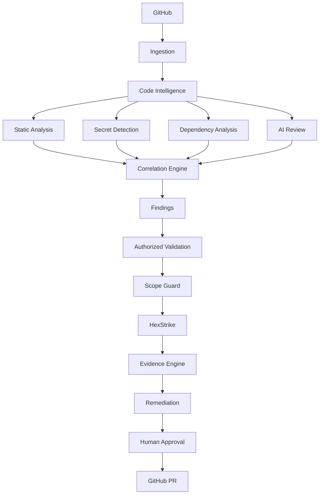

# Sayan Sentinel

**AI-Native Application Security & Code Intelligence**

> Understand your code. Find vulnerabilities. Verify safely. Fix intelligently. Ship safer software.


Built by [Sayan Stack](https://github.com/).

---

## What this is

Sayan Sentinel connects to an authorized GitHub repository, builds an
internal code graph, runs deterministic security analysis (SAST, secret
detection, dependency scanning), correlates the results with AI-assisted
reasoning, and — only against explicitly authorized targets, behind a
deterministic Scope Guard — offers optional dynamic validation via
[HexStrike AI](https://github.com/) before generating a human-reviewed
remediation PR.

This is **not** a vulnerability scanner you point at arbitrary internet
targets, and it does not claim a capability is complete unless it genuinely
is. See [Status](#status) below for exactly what's real today.

## Status

This repository is being built in public, phase by phase, tracked in
[docs/implementation-plan.md](docs/implementation-plan.md). Currently:

- ✅ Monorepo scaffold (pnpm + Turborepo), root tooling, local infra
  (`docker compose up` for Postgres/Redis/MinIO)
- ✅ `packages/shared`, `packages/config`, `packages/database` — vocabulary
  types, validated env/feature-flag loading, and the full tenant-isolated
  Prisma schema
- ✅ `apps/api` skeleton — structured logging with request IDs and secret
  redaction, plus `/health/live` and `/health/ready` (the latter genuinely
  checks Postgres and Redis and reports `down` truthfully when they're
  unreachable, verified end-to-end with no infra running)
- ✅ `packages/code-intelligence` — repository ingestion (real `git`
  subprocess calls, path-traversal/symlink protection, size limits, binary
  exclusion, no repository code is ever executed) and an AST-based code
  graph (`ts-morph`) detecting imports, functions/classes/methods, Express
  and NestJS routes, env-var reads, outbound HTTP calls, Prisma-style
  queries, and NestJS auth guards
- ✅ `packages/findings` — canonical Finding model and stable,
  snippet-anchored fingerprinting
- ✅ `packages/security-engine` — Semgrep, Gitleaks, and OSV-Scanner
  adapters, normalized into the Finding model. None of the three tools are
  installed on this dev machine, so their "not available" path is what's
  actually exercised end-to-end here; each adapter reports that honestly
  rather than faking a clean scan. Gitleaks findings never carry the raw
  discovered secret — it's masked before the finding is even constructed.
- ✅ Finding correlation (`correlateFindings`) and the **Sentinel Security
  Score** (`computeSecurityScore`) — both fully documented, deterministic
  formulas in `packages/findings`, no random or hard-coded numbers.
- ✅ `packages/ai-engine` — provider abstraction (Anthropic/OpenAI/local),
  schema-validated structured output (the model's raw text is never
  trusted directly), and the Section 14 prompt-injection defenses: every
  piece of repository content is wrapped in explicit untrusted-data
  markers and pattern-redacted for secrets before it's ever sent. No AI
  credentials are configured in this environment, so this hasn't been
  exercised against a live model — that's stated plainly, not glossed
  over.
- 🚧 Everything else — worker orchestration, Scope Guard, HexStrike
  adapter, GitHub App, remediation/PR workflow, frontend — is under active
  development. Nothing not listed above should be assumed to work yet.

No fake scanners, no fabricated findings, no hard-coded security scores, no
mock GitHub data will ever ship here — an unfinished feature is left in a
clearly-labeled "not implemented yet" or "not configured" state instead.

## Architecture



Full diagrams (scan pipeline, correlation, HexStrike authorization flow,
GitHub event flow) live in [docs/architecture.md](docs/architecture.md).

## Monorepo layout

```
apps/
  web/      Next.js frontend
  api/      NestJS API
  worker/   BullMQ job processors
packages/
  ui/                  shared component library
  database/            Prisma schema + client
  auth/                session-based auth
  github/              GitHub App integration
  code-intelligence/   AST-based code graph
  security-engine/     Semgrep / Gitleaks / OSV-Scanner adapters
  ai-engine/           provider-agnostic AI reasoning layer
  findings/            canonical Finding model + correlation
  policy-engine/       repository policy evaluation
  hexstrike-adapter/   dynamic validation provider (Scope Guard-gated)
  shared/              cross-cutting types/utilities
  config/              typed environment/config loading
examples/
  vulnerable-demo-app/ intentionally vulnerable local fixture
docs/                  architecture, threat model, integration docs
```

## Technology

TypeScript · Next.js · React · Tailwind · NestJS · PostgreSQL · Prisma ·
Redis/BullMQ · Docker · GitHub Actions.

## Quick start (current state)

```bash
git clone <repo-url> sayan-sentinel
cd sayan-sentinel
cp .env.example .env
pnpm install
docker compose up -d   # Postgres, Redis, MinIO
```

The API/web/worker apps and database schema are not implemented yet — this
brings up the backing infrastructure only. Follow
[docs/implementation-plan.md](docs/implementation-plan.md) for what's
runnable at any given point.

## Security model

See [docs/threat-model.md](docs/threat-model.md),
[docs/security-model.md](docs/security-model.md), and
[docs/scope-guard.md](docs/scope-guard.md) once written. Repository content
is always treated as untrusted input; dynamic validation is never performed
against a target that hasn't passed explicit authorization + Scope Guard.

## License

[MIT](LICENSE). Third-party scanner licenses are documented in
`docs/licensing.md` (Phase 7).
