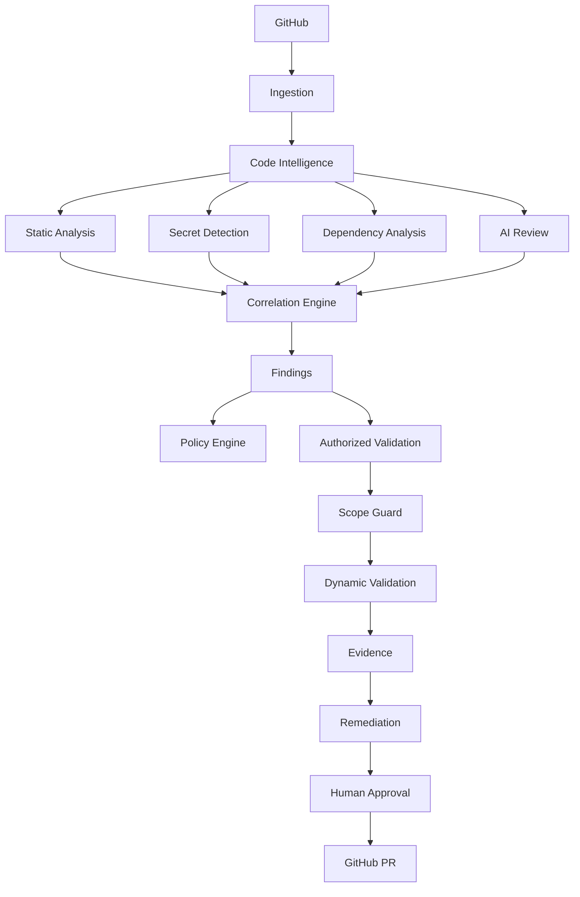

# Architecture

## System overview



## Monorepo layout and what's real

```
apps/
  api/      NestJS — config loading, structured logging, /health/live and
            /health/ready (genuinely checks Postgres/Redis). No
            repository/scan/finding CRUD endpoints yet.
  worker/   BullMQ job processors. runScanPipeline() is real and tested
            (clone → walk → code graph → scanners → correlate → score →
            policy → optional AI). Queue/Worker wiring is real but
            unexercised against a live Redis in this environment.
  web/      not yet built.

packages/
  shared/              branded IDs, severity/status vocabulary, Result
                       type, redaction utilities.
  config/              zod-validated env loading, derived feature flags.
  database/            Prisma schema for the full Section 32 data model.
                       Not yet migrated against a live database here.
  auth/                not yet built.
  github/              webhook verification, delivery dedup, PR-diff
                       triage, GitHubAppClient (real @octokit/app usage,
                       not exercised against a live GitHub App here).
  code-intelligence/   git ingestion (real subprocess git, tested against
                       a real local repo) + ts-morph AST code graph.
  security-engine/     Semgrep/Gitleaks/OSV-Scanner adapters. None of the
                       three tools are installed in this environment, so
                       their "unavailable" path is what's actually
                       exercised end to end here.
  ai-engine/           provider abstraction (Anthropic/OpenAI/local),
                       prompt-injection defenses, schema-validated
                       structured output. No AI credentials configured
                       here.
  findings/            canonical Finding model, fingerprinting,
                       correlation engine, Sentinel Security Score.
  policy-engine/       Section 28's example repository policies.
  security-core/       Scope Guard (SSRF/DNS-rebinding/authorization
                       boundary) + a remote dynamic-validation REST
                       client, built against a real, verified API surface.
  ui/, config (frontend)/  not yet built.

examples/
  vulnerable-demo-app/ intentionally vulnerable fixture, verified
                       analyzable by the real ingestion + AST pipeline.
```

## Data flow through what's implemented today

1. `apps/worker`'s `runScanPipeline` clones a commit
   (`packages/code-intelligence`'s `cloneRepositoryAtCommit`, a blobless
   partial clone via `git`, never executing repository content).
2. The same package's `walkRepositoryFiles` applies path-traversal/
   symlink protection, size limits, and binary exclusion, then
   `buildCodeGraphFromDirectory` produces an AST-based code graph
   (`ts-morph`).
3. Every configured `packages/security-engine` adapter is asked
   `checkAvailability()` first; only available ones run, and their raw
   output is normalized into `packages/findings`' `FindingDraft` shape.
4. `packages/findings`' `correlateFindings()` merges drafts describing the
   same issue from different detectors into one `CorrelatedFinding`;
   `computeSecurityScore()` produces the Sentinel Security Score.
5. `packages/policy-engine`'s `evaluatePolicy()` checks the correlated
   findings against the repository's enabled policies.
6. If an AI provider is configured, the top findings by severity are sent
   through `packages/ai-engine`'s `completeStructured()` — every piece of
   repository-derived context is wrapped as untrusted and redacted for
   secrets first.
7. Dynamic validation (`packages/security-core`) is a separate,
   on-demand path, not part of the automatic scan: every `validate()` call
   runs Scope Guard first, unconditionally, before any backend call.

## Not yet built

Findings persistence (a fresh scan currently has no history — every
finding is scored/evaluated as freshly "open"), the remediation/patch/PR
workflow, the frontend, and multi-tenant API endpoints. See
[implementation-plan.md](implementation-plan.md) for the authoritative,
continuously-updated phase-by-phase status.
